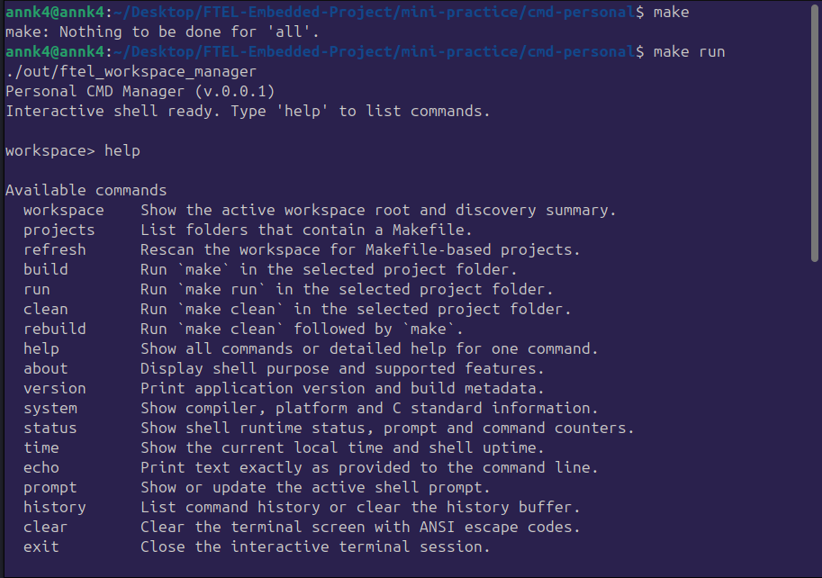
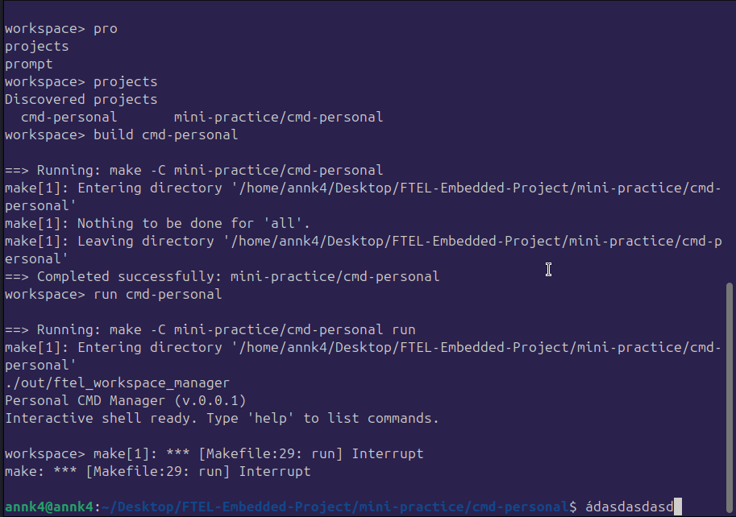

# cmd-personal

`cmd-personal` là một mini shell chạy trên Terminal để quản lý các project có `Makefile` trong workspace. Phần này vừa là ví dụ về cách tự xây dựng command-line interface bằng C, vừa là một công cụ nhỏ để quét project, gọi `make`, `make run`, `make clean`, và `rebuild` ngay trong cùng một phiên shell.




## Nó dùng để làm gì?

- Tạo một shell tương tác có prompt riêng, mặc định là `workspace>`.
- Tự quét workspace để tìm các thư mục có `Makefile`.
- Cho phép chạy lệnh build/run/clean/rebuild cho từng project tìm thấy.
- Có sẵn các lệnh tiện ích như `help`, `about`, `status`, `history`, `prompt`, `clear`, `exit`.
- Hỗ trợ tab completion khi chạy trong terminal thật.

## Các file chính

- `new_cmd_line.c`: phần cài đặt CLI engine và demo workspace manager.
- `new_cmd_line.h`: public API của module command line.
- `Makefile`: cách build và chạy bản demo trên máy host.
- `out/ftel_workspace_manager`: file thực thi sinh ra sau khi build.

## Cách chạy

Từ thư mục project gốc:

```bash
cd mini-practice/cmd-personal
make build
make run
```

Hoặc chạy trực tiếp binary sau khi build:

```bash
./out/ftel_workspace_manager
```

Khi khởi động, chương trình sẽ hiện kiểu như sau:

```text
Personal CMD Manager (v.0.0.1)
Interactive shell ready. Type 'help' to list commands.

workspace>
```

## Dùng như nào trong Terminal?

Bạn gõ lệnh ngay sau prompt `workspace>` rồi nhấn `Enter`.

Ví dụ một phiên dùng cơ bản:

```text
workspace> help
workspace> projects
workspace> build cmd-personal
workspace> status
workspace> exit
```

Ví dụ output thực tế:

```text
Personal CMD Manager (v.0.0.1)
Interactive shell ready. Type 'help' to list commands.

workspace> projects
Discovered projects
  cmd-personal       mini-practice/cmd-personal
workspace>
==> Running: make -C mini-practice/cmd-personal
make: Nothing to be done for 'all'.
==> Completed successfully: mini-practice/cmd-personal
workspace> exit
Closing terminal session.
```

## Các lệnh quan trọng

| Lệnh | Ý nghĩa |
| --- | --- |
| `help` | Liệt kê toàn bộ lệnh hoặc xem chi tiết bằng `help <command>` |
| `about` | Giới thiệu shell này dùng để làm gì |
| `projects` | Liệt kê các project có `Makefile` được tìm thấy |
| `workspace` | In ra workspace root và số project đã quét |
| `refresh` | Quét lại workspace |
| `build <name>` | Chạy `make` trong project được chọn |
| `run <name>` | Chạy `make run` trong project được chọn |
| `clean <name>` | Chạy `make clean` trong project được chọn |
| `rebuild <name>` | Chạy `make clean` rồi `make` |
| `history` | Xem lịch sử lệnh |
| `prompt <text>` | Đổi prompt hiện tại |
| `clear` | Xóa màn hình terminal |
| `exit` | Thoát shell |

## Cách chọn project

Shell chấp nhận cả 2 kiểu:

```text
build cmd-personal
build project cmd-personal
```

Tên lệnh không phân biệt hoa thường, nên `Build cmd-personal` vẫn được hiểu. Ngoài ra chương trình còn bỏ qua ký tự `*` ở đầu lệnh, nên kiểu nhập như `*Build project cmd-personal` cũng vẫn chạy được.

## Terminal hoạt động như thế nào?

- Chương trình chạy theo kiểu REPL: đọc lệnh, xử lý, in kết quả, rồi chờ lệnh tiếp theo.
- Nếu đang chạy trong terminal tương tác, shell bật raw mode để đọc từng phím.
- Nhấn `Tab` để gợi ý hoặc hoàn thành tên lệnh / tên project.
- `Backspace` xóa ký tự vừa nhập.
- `Ctrl + D` trên dòng trống sẽ đóng phiên terminal.
- Khi gọi `build`, `run`, `clean`, `rebuild`, chương trình dùng `make -C <project>` để chạy trực tiếp trong thư mục project.
- Output của `make` được stream thẳng ra terminal, nên người dùng thấy log ngay lập tức.

## Lưu ý với project này

Trong chính thư mục `cmd-personal`, target `run` của `Makefile` sẽ chạy lại binary `./out/ftel_workspace_manager`. Nghĩa là nếu bạn dùng:

```text
workspace> run cmd-personal
```

thì shell sẽ mở một phiên manager mới từ target `make run`.

## Mẹo nhanh

- Gõ `help` trước nếu chưa nhớ lệnh.
- Gõ `projects` để biết tên project hợp lệ.
- Gõ `history` để xem các lệnh vừa chạy.
- Gõ `prompt dev-shell>` để đổi prompt cho dễ nhận biết.
